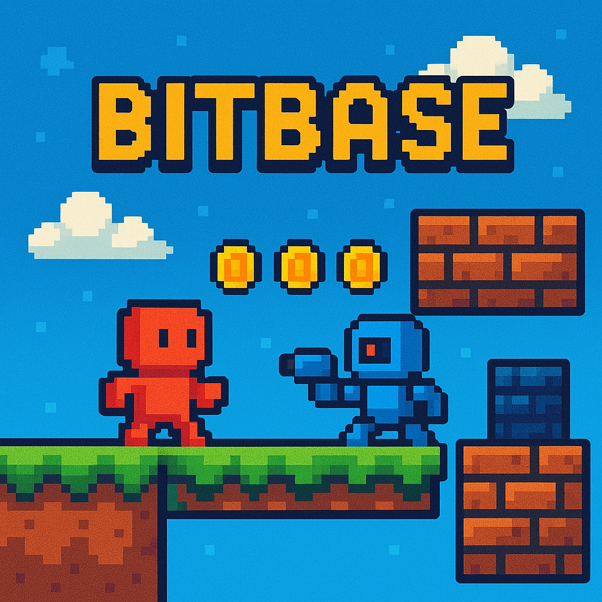

# BitBase

<div align="center">
  
  <br>
  <h3>A retro-inspired 2D adventure game built with Go and Ebitengine</h3>
</div>

## 🎮 Overview

BitBase is a 2D pixel art adventure game where players explore a vast world, interact with objects, manage inventory, and embark on quests. Built with Go using the Ebitengine game library, BitBase combines retro aesthetics with modern game design principles.

## ✨ Features

- **State-Based Game Architecture**: Smooth transitions between loading, menu, gameplay, and pause states
- **Fluid Character Movement**: Responsive controls with animated player character
- **Dynamic Camera System**: Follows player movement with smooth transitions
- **Loading Screen**: Attractive loading screen with progress bar and logo
- **Interactive UI**: Buttons, progress bars, and other UI elements
- **Asset Management**: Efficient loading and caching of game resources
- **Game World**: Tile-based world with collision detection

## 🚀 Getting Started

### Prerequisites

- Go 1.23 or later
- Git

### Installation

1. Clone the repository:
   ```bash
   git clone https://github.com/Nathene/bitbase.git
   cd bitbase
   ```

2. Install dependencies:
   ```bash
   go mod download
   ```

3. Run the game:
   ```bash
   go run cmd/main.go
   ```

## 🔧 Project Structure

```
bitbase/
├── assets/              # Game assets (images, audio, etc.)
│   ├── character/       # Character sprites and animations
│   ├── loading_screen/  # Loading screen assets
│   ├── objects/         # Game object sprites
│   ├── tilesets/        # World tile graphics
│   └── world/           # World maps and backgrounds
├── cmd/                 # Application entry points
├── common/              # Shared utilities and helpers
├── constants/           # Game constants
├── entity/              # Entity system
│   └── player/          # Player-specific code
├── game/                # Core game logic
│   ├── states/          # Game state management
│   ├── ui/              # User interface components
│   └── textdraw/        # Text rendering utilities
├── input/               # Input handling
├── ui/                  # UI components
└── world/               # World generation and management
```

## 🎮 Controls

- **Arrow Keys**: Move character
- **E**: Interact with objects/NPCs (Coming soon)
- **I**: Toggle inventory (Coming soon)
- **Esc**: Pause game
- **Enter/Space**: Select menu items

## 🧩 Game Architecture

BitBase uses a state-based architecture to manage different game screens:

- **LoadingState**: Handles asset loading with a progress bar
- **MenuState**: Main menu with options to play, configure settings, or exit
- **GameplayState**: The main gameplay where player exploration happens
- **PauseState**: Pause menu during gameplay

## 🖼️ Screenshots

(Coming soon)

## 🛠️ Development

### Building for Different Platforms

```bash
# Build for Windows
GOOS=windows GOARCH=amd64 go build -o bitbase.exe cmd/main.go

# Build for macOS
GOOS=darwin GOARCH=amd64 go build -o bitbase cmd/main.go

# Build for Linux
GOOS=linux GOARCH=amd64 go build -o bitbase cmd/main.go
```

### Running Tests

```bash
go test ./...
```

## 📝 License

This project is licensed under the MIT License - see the LICENSE file for details.

## 🙏 Acknowledgments

- [Ebitengine](https://ebitengine.org/) - The game engine powering BitBase
- All the amazing pixel artists whose work inspired this project

---

<div align="center">
  <small>Made with ❤️ by Nathene</small>
</div> 